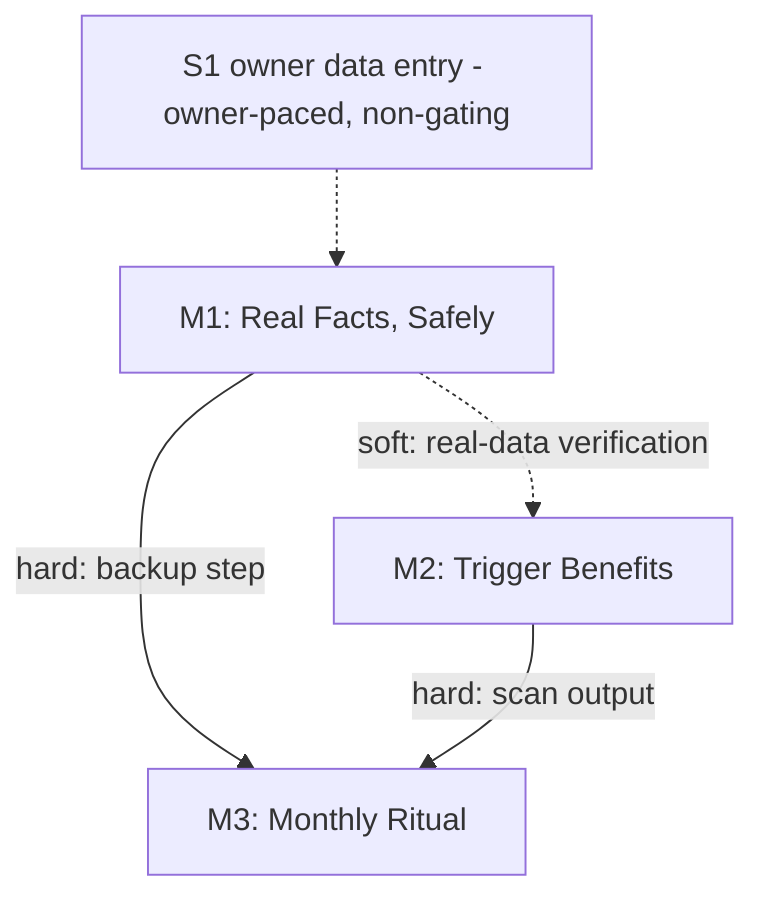

# System Overview: UTBIS — First Real User Arc

## Version History

| Version | Date | Author | Changes |
| --- | --- | --- | --- |
| 1.0 | 2026-07-10 | Travis Cox (PM/PO) with Claude Code | Initial version, from approved project PRD |

> System PRD for the **arc**, not a re-specification of the already-built UTBIS platform — the
> platform inventory is the approved Architecture doc. This document is the stable parent for the
> arc's Milestone PRDs.

---

## 1. Vision

UTBIS becomes a working tool, not a demo: its first real user (the owner's single-member LLC)
gets scan results computed from real books, with threshold-trigger benefits that state the dollar
distance to each CPA-conversation-worthy opportunity, maintained by a one-command monthly ritual.
The system's promise — "tells you when a CPA conversation becomes worth its fee" — is proven on
its own author first.

---

## 2. Success Metrics

| Metric | Target | Measurement Method | Timeline |
| --- | --- | --- | --- |
| Trigger report vs real books | §41 + S-corp shown with correct distance | Scan on owner profile (once S1 lands) | End of arc |
| Library + rule quality | §41 record + trigger rules green; suite ≥396, lint/build clean | CI | Each milestone exit |
| Privacy invariant | Guard test green; zero real values committed | CI + review | Continuous |
| Data safety | Dated `pg_dump` + one verified restore | Manual verification exercise | M1 exit |
| Ritual viability | One command, walked through once, duration recorded (aspirational ≤15 min) | Timed walkthrough | M3 exit |

---

## 3. Milestone Map

### 3.1 Overview

| ID | Name | Duration | Depends On | Delivers | PRD Link |
| --- | --- | --- | --- | --- | --- |
| M1 | Real Facts, Safely | ~1 dev session + owner-paced entry | — | Backup+restore procedure; owner data entry path cleared (entry itself owner-paced) | milestone-1-prd (next phase) |
| M2 | Trigger Benefits | ~2–3 dev sessions | — (soft on M1) | §41 record, S-corp threshold, structured trigger data, Dashboard trigger table, report section | milestone-2-prd (next phase) |
| M3 | Monthly Ritual | ~1–2 dev sessions | M2 (hard), M1 (hard for backup step) | One-command ritual: CSV validate → aggregates → scan → report; ritual doc v2 | milestone-3-prd (next phase) |

### 3.2 Milestone Summaries

#### M1: Real Facts, Safely

**Objective:** The owner's real tax profile can live in the local DB without being the only copy
of anything — backup exists and restore is proven — and the entry path (My Data, worksheet in
hand) is documented and unblocked.

**Key Deliverables:**
- `pg_dump`-based backup command/step (gitignored destination), documented in the ritual doc
- One verified restore to a scratch DB with a spot-checked businesses section
- Entry checklist appended to the worksheet/private README (which My Data sections, which fields, scanner vocabulary notes)
- (Owner-paced, non-gating) real facts entered via My Data — S1

**Success Criteria:**
- [ ] Backup produces a dated dump; restore verified once
- [ ] Guard test still green; backup destination gitignored
- [ ] Entry checklist exists; S1 explicitly *not* an exit gate (PM/PO 2026-07-10)

**Impact on Other Milestones:**
- Provides the backup step M3's ritual doc folds in
- Real data (when entered) upgrades M2's verification from synthetic to real

#### M2: Trigger Benefits

**Objective:** The scanner knows about the two standing tax triggers and reports "almost
available" with structured distance — the arc's core user value.

**Key Deliverables:**
- Benefit YAML schema extension: threshold-trigger fields (FR-009, additive)
- §41 R&D credit record (`tax_library/federal/`) with $5k cash-spend trigger, §174A note, QSB offset path, QRE scope note
- S-corp record extended with $40k net-profit trigger (existing behavior preserved)
- `ScanResult` extended with optional structured trigger object (canonical shape: §5.2)
- Dashboard trigger-table component (PM/PO placement decision 2026-07-10); markdown report section
- Vitest coverage: below/at/above threshold, loss case, missing facts — synthetic fixtures only

**Success Criteria:**
- [ ] Seeded-profile scan shows both triggers with correct threshold/current/distance/fired
- [ ] Full suite ≥396 green, lint + both builds clean
- [ ] Trigger language is "evaluate with CPA" everywhere; non-goal note in records

**Impact on Other Milestones:**
- Provides the scan output M3's ritual surfaces
- Establishes the trigger pattern future threshold benefits reuse (post-arc library growth)

#### M3: Monthly Ritual

**Objective:** Monthly upkeep is one sitting: validate books, recompute aggregates, scan, review
triggers, back up.

**Key Deliverables:**
- Ritual command (npm script in `backend-ts`): CSV schema validation (row-level errors) → aggregate recompute → write to businesses section → scan → surface report
- Ritual doc v2 (`user_data/private/README.md`): command + backup + receipts, one timed walkthrough recorded
- Vitest coverage with synthetic CSV fixtures (valid, malformed row, unknown category, year arg)

**Success Criteria:**
- [ ] One command runs the chain end-to-end against a test profile
- [ ] Malformed input writes nothing and names the offending row
- [ ] Walkthrough performed once; duration recorded (not gated)

**Impact on Other Milestones:**
- Completes the arc; closes the loop that keeps M2's triggers honest month over month

---

## 4. Dependency Graph

### 4.1 Visual Representation



### 4.2 Critical Path

M2 → M3. (M1 is parallel-safe; only its backup step gates M3's ritual doc.)

### 4.3 Inter-Milestone Dependencies

| From | To | Dependency Type | Description |
| --- | --- | --- | --- |
| M1 | M2 | Soft | Real-data verification of triggers; synthetic verification suffices for exit |
| M1 | M3 | Hard | Ritual doc v2 folds in the backup step |
| M2 | M3 | Hard | Ritual surfaces the trigger table produced in M2 |

---

## 5. Shared Context

### 5.1 Tech Stack Reference

Canonical inventory: [2026-07-10-architecture-utbis.md](./2026-07-10-architecture-utbis.md).
Key decisions for this arc: no new dependencies; raw `pg` + repo modules; benefit YAML remains the
library format; Dashboard components follow existing card/status patterns.

### 5.2 Data Models (Canonical)

**Trigger object** (added to `ScanResult` as optional field; exact TS shape finalized at M2
design but this is the contract Milestone PRDs reference):

```typescript
// backend-ts/src/domain/scanner/types.ts (extension)
type TriggerStatus = {
  metric: string;          // e.g. "annual_cash_operating_spend" | "net_profit"
  label: string;           // human-readable, for Dashboard display (PM/PO 2026-07-10)
                           // e.g. "Annual cash operating spend" / "Net profit"
  threshold: number;       // from benefit YAML (FR-009)
  comparison: "gte" | "lte"; // both built this arc (PM/PO 2026-07-10)
  current_value: number;   // computed from UserFacts
  distance: number;        // gte: max(0, threshold - current_value)
                           // lte: max(0, current_value - threshold); 0 when fired
  fired: boolean;          // gte: current >= threshold; lte: current <= threshold
};
// ScanResult gains: trigger?: TriggerStatus
```

**Benefit YAML extension** (additive; loader-validated):

```yaml
trigger:
  metric: net_profit          # scanner-known metric key
  label: "Net profit"         # human-readable, shown on Dashboard
  threshold: 40000            # dollars; CPA-adjustable without code change
  comparison: gte             # gte | lte (lte = "stay under X" triggers)
```

Existing canonical models unchanged: 9 typed section tables (`data_json` canonical), benefit
record schema per `tax_library/example-benefit.yaml`, books CSV columns per
`user_data/private/README.md`.

### 5.3 API Contracts (Shared)

No new endpoints anticipated. Existing contracts consumed:

| Endpoint | Method | Purpose | Used by |
| --- | --- | --- | --- |
| `/api/scan` | POST | Run scan (returns `ScanRun` incl. trigger data after M2) | M2, M3 |
| `/api/user-data/:section` | GET/PUT | Section read/write (M3 aggregate write mechanism — open question, M3 design) | M1 (entry), M3 |
| `/api/health` | GET | Ritual precondition check | M3 |

### 5.4 Glossary (canonical — Milestone PRDs reference, don't redefine)

| Term | Definition | Used In |
| --- | --- | --- |
| Trigger benefit | Benefit with a YAML-defined dollar threshold reported fired/not-fired with distance | M2, M3 |
| Distance-to-threshold | Dollars to firing: gte → `max(0, threshold − current)`; lte → `max(0, current − threshold)` | M2, M3 |
| Books | `user_data/private/books/<year>-transactions.csv`; cash system of record | M1, M3 |
| Ritual | The documented monthly loop: books → aggregates → scan → review → backup | M1, M3 |
| Worksheet | `user_data/private/businesses.local.yaml`; entry source for My Data, never merged by code | M1 |
| Guard test | `backend-ts/test/privateDataIgnored.test.ts`; CI enforcement of the privacy invariant | All |
| Standing triggers | Lab cost-discipline §1.10: ~$5k cash spend → §41; ~$40k net profit → S-corp | M2 |

---

## 6. Cross-Cutting Concerns

### 6.1 Security / Privacy Requirements

| Requirement | Priority | Milestone | Notes |
| --- | --- | --- | --- |
| No real financial values in any committed artifact | Must | All | Synthetic fixtures rule; review at every PR |
| `user_data/private/` + backup destination gitignored, CI-enforced | Must | M1 | Extend guard test when backup dir chosen |
| Per-user data isolation on all new writes | Must | M3 | Ritual writes only to authenticated owner account |
| Not-tax-advice boundary in all trigger language | Must | M2 | "Evaluate with CPA"; non-goal note in records |

### 6.2 Performance Requirements

No new targets. Scan stays interactive-speed locally; ritual command end-to-end well under the
aspirational 15-minute total (command itself: seconds-to-a-minute class).

### 6.3 Accessibility Requirements

Dashboard trigger table meets the Phase A/B component standards already in the codebase
(fieldset/label association, focus-visible, status colors not sole carrier of meaning).

### 6.4 Compliance Requirements

N/A beyond the not-tax-advice boundary (§6.1).

---

## 7. Assumptions and Constraints

### 7.1 Assumptions

| ID | Assumption | Impact if Wrong | Validation Plan |
| --- | --- | --- | --- |
| A1 | Owner keeps worksheet/profile current; TODOs tolerable as `missing_facts` | Triggers computed on stale numbers | Ritual step reconciles monthly |
| A2 | $5k/$40k are adjustable heuristics, not advice | Threshold changes are YAML edits | FR-009 keeps them in YAML |
| A3 | Rule engine + YAML schema extend additively for triggers | Fall back to report-layer distance computation | M2 design review validates before build |
| A4 | Seeded profile suffices for M2 verification until S1 lands | Real-data quirks found late | Re-verify on owner profile when entered |

### 7.2 Constraints

| ID | Constraint | Impact | Mitigation |
| --- | --- | --- | --- |
| C1 | Founder-hours are the budget (lab §1.8) | Small milestones, no gold-plating | Ponytail discipline; exit gates minimal |
| C2 | Public repo | Privacy invariant is Must everywhere | Guard test + synthetic-only rule |
| C3 | Solo team | No parallel milestone execution | Sequence M2 → M3; M1 backup slots anywhere |
| C4 | Existing stack frozen | No new deps for triggers/ritual | Stdlib/in-repo patterns only |

---

## 8. Risk Assessment

### 8.1 Project Risks

| ID | Risk | Probability | Impact | Mitigation | Owner |
| --- | --- | --- | --- | --- | --- |
| R1 | S1 (data entry) stalls indefinitely — arc ships but proves nothing real | M | M | S1 non-gating but tracked; ritual walkthrough nudges entry; triggers still verified synthetically | PM/PO |
| R2 | Scope creep into library expansion mid-arc | M | M | Out-of-scope list in project PRD; new benefits wait for next arc | PM/PO |

### 8.2 Technical Risks

| ID | Risk | Probability | Impact | Mitigation | Milestone |
| --- | --- | --- | --- | --- | --- |
| T1 | Trigger semantics don't fit rule engine cleanly (A3) | M | M | Design review before build; report-layer fallback | M2 |
| T2 | Aggregate write path (API vs repo) conflicts with typed-column sync | L | M | Reuse `saveSectionData` path that already syncs indexes | M3 |
| T3 | pg_dump/restore version caveats on Windows | L | L | Document caveat; verify restore once (that's the test) | M1 |

---

## 9. Stakeholders

Solo project — RACI collapses to: Travis Cox is Responsible/Accountable for all areas
(PM/PO, Tech Lead, QA, first user), AI-augmented via Claude Code; CPA is Consulted only
post-arc when a trigger fires. Communication plan: phase checkpoints in-session (this process);
sprint report with cost line (founder-hours + spend) per lab discipline §1.7 at sprint close.

---

## 10. Milestone PRD Links

| Milestone | PRD Document | Status | Last Updated |
| --- | --- | --- | --- |
| M1: Real Facts, Safely | [2026-07-10-milestone-1-prd.md](./2026-07-10-milestone-1-prd.md) | In Review | 2026-07-10 |
| M2: Trigger Benefits | [2026-07-10-milestone-2-prd.md](./2026-07-10-milestone-2-prd.md) | In Review | 2026-07-10 |
| M3: Monthly Ritual | [2026-07-10-milestone-3-prd.md](./2026-07-10-milestone-3-prd.md) | In Review | 2026-07-10 |

---

## 11. Change Log

| Date | Change | Author | Reason | Impact |
| --- | --- | --- | --- | --- |
| 2026-07-10 | Initial version | TC + Claude Code | Arc kickoff from approved project PRD | — |
| 2026-07-10 | Gate amendments: `label` added to TriggerStatus; `lte` comparison built this arc | TC (PM/PO) | System PRD checkpoint interview | M2 scope +small |

---

## 12. Approvals

| Role | Name | Date | Signature |
| --- | --- | --- | --- |
| Product Owner / Sponsor / Tech Lead | Travis Cox | — | ☐ Approved |
