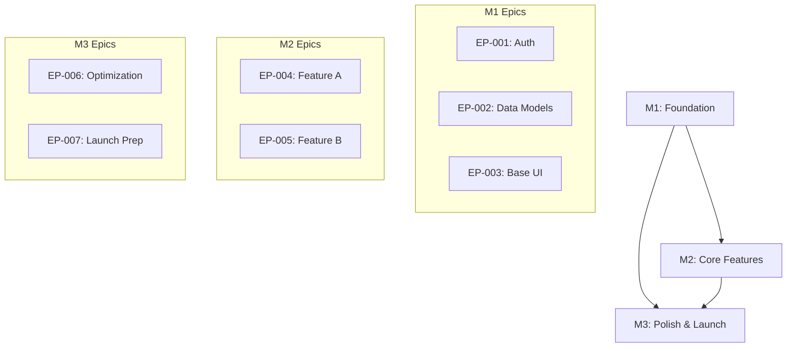
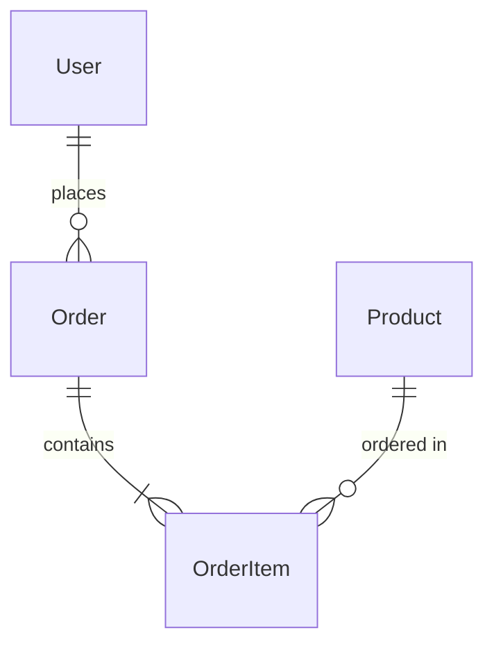

# System Overview: [Project Name]

## Version History

| Version | Date   | Author | Changes         |
| ------- | ------ | ------ | --------------- |
| 1.0     | [Date] | [Name] | Initial version |

---

## 1. Vision

[2-3 sentences describing the core vision and purpose of this system. What problem does it solve? Why does it matter?]

---

## 2. Success Metrics

| Metric               | Target         | Measurement Method | Timeline |
| -------------------- | -------------- | ------------------ | -------- |
| [Business metric 1]  | [Target value] | [How measured]     | [When]   |
| [Business metric 2]  | [Target value] | [How measured]     | [When]   |
| [Technical metric 1] | [Target value] | [How measured]     | [When]   |
| [User metric 1]      | [Target value] | [How measured]     | [When]   |

---

## 3. Milestone Map

### 3.1 Overview

| ID  | Name             | Duration  | Depends On | Delivers      | PRD Link                                   |
| --- | ---------------- | --------- | ---------- | ------------- | ------------------------------------------ |
| M1  | [Milestone Name] | [X weeks] | -          | [Key outputs] | [milestone-1-prd.md](./milestone-1-prd.md) |
| M2  | [Milestone Name] | [X weeks] | M1         | [Key outputs] | [milestone-2-prd.md](./milestone-2-prd.md) |
| M3  | [Milestone Name] | [X weeks] | M1, M2     | [Key outputs] | [milestone-3-prd.md](./milestone-3-prd.md) |

### 3.2 Milestone Summaries

#### M1: [Milestone Name]

**Objective:** [What user value does this milestone deliver?]

**Key Deliverables:**

- [Deliverable 1]
- [Deliverable 2]
- [Deliverable 3]

**Success Criteria:**

- [ ] [Measurable criterion 1]
- [ ] [Measurable criterion 2]

**Impact on Other Milestones:**

- Enables M2 by providing [capability]
- Establishes foundation for M3's [feature]

---

#### M2: [Milestone Name]

**Objective:** [What user value does this milestone deliver?]

**Key Deliverables:**

- [Deliverable 1]
- [Deliverable 2]
- [Deliverable 3]

**Success Criteria:**

- [ ] [Measurable criterion 1]
- [ ] [Measurable criterion 2]

**Impact on Other Milestones:**

- Builds on M1's [capability]
- Provides [capability] needed by M3

---

#### M3: [Milestone Name]

**Objective:** [What user value does this milestone deliver?]

**Key Deliverables:**

- [Deliverable 1]
- [Deliverable 2]
- [Deliverable 3]

**Success Criteria:**

- [ ] [Measurable criterion 1]
- [ ] [Measurable criterion 2]

**Impact on Other Milestones:**

- Completes features started in M1 and M2
- Represents launch-ready state

---

## 4. Dependency Graph

### 4.1 Visual Representation



### 4.2 Critical Path

```
M1 (Foundation) → M2 (Core Features) → M3 (Polish & Launch)
     ↓                   ↓                    ↓
  4 weeks            4 weeks              4 weeks
```

### 4.3 Inter-Milestone Dependencies

| From | To  | Dependency Type | Description                                           |
| ---- | --- | --------------- | ----------------------------------------------------- |
| M1   | M2  | Hard            | M2 requires M1's authentication system                |
| M1   | M3  | Soft            | M3 can start UI work before M1 completes              |
| M2   | M3  | Hard            | M3's optimization requires M2 features to be complete |

---

## 5. Shared Context

### 5.1 Tech Stack Reference

[Link to Architecture Template: [architecture-template.md](../SOW/architecture-template.md)]

**Key Technology Decisions:**

| Area     | Choice       | Rationale |
| -------- | ------------ | --------- |
| Frontend | [Technology] | [Why]     |
| Backend  | [Technology] | [Why]     |
| Database | [Technology] | [Why]     |
| Hosting  | [Provider]   | [Why]     |

### 5.2 Data Models (Canonical)

These data models are the single source of truth. Milestone PRDs reference but do not duplicate these definitions.

#### Core Entities

```typescript
// User - Central identity model
interface User {
  id: UUID;
  email: string; // unique, indexed
  passwordHash: string;
  profile: UserProfile;
  createdAt: timestamp;
  updatedAt: timestamp;
}

// [Additional core entities...]
```

#### Relationships



### 5.3 API Contracts (Shared)

APIs used across multiple milestones are defined here.

#### Authentication API

| Endpoint               | Method | Purpose       | Defined In |
| ---------------------- | ------ | ------------- | ---------- |
| `/api/v1/auth/login`   | POST   | User login    | M1         |
| `/api/v1/auth/logout`  | POST   | User logout   | M1         |
| `/api/v1/auth/refresh` | POST   | Token refresh | M1         |

#### [Additional shared APIs...]

### 5.4 Glossary

| Term     | Definition         | Used In  |
| -------- | ------------------ | -------- |
| [Term 1] | [Clear definition] | [M1, M2] |
| [Term 2] | [Clear definition] | [All]    |
| [Term 3] | [Clear definition] | [M2, M3] |

---

## 6. Cross-Cutting Concerns

### 6.1 Security Requirements

| Requirement                 | Priority | Milestone | Notes                      |
| --------------------------- | -------- | --------- | -------------------------- |
| [JWT-based authentication]  | Must     | M1        | Foundation for all auth    |
| [Role-based access control] | Must     | M1        | Admin, User, Guest roles   |
| [Data encryption at rest]   | Must     | M1        | AES-256 for sensitive data |
| [HTTPS everywhere]          | Must     | M1        | TLS 1.3 minimum            |
| [Audit logging]             | Should   | M2        | All admin actions          |

### 6.2 Performance Requirements

| Metric            | Target        | Applies To    | Measured By |
| ----------------- | ------------- | ------------- | ----------- |
| Page load time    | < 2s (p95)    | All pages     | Lighthouse  |
| API response time | < 200ms (p95) | All endpoints | APM         |
| Database queries  | < 50ms (p95)  | All queries   | Query logs  |
| Concurrent users  | 1000+         | Production    | Load tests  |

### 6.3 Accessibility Requirements

| Standard | Level | Notes                                 |
| -------- | ----- | ------------------------------------- |
| WCAG 2.1 | AA    | Required for all user-facing features |

### 6.4 Compliance Requirements

| Requirement | Status   | Notes                   |
| ----------- | -------- | ----------------------- |
| [GDPR]      | Required | EU user data handling   |
| [SOC 2]     | Planned  | Q4 certification target |

---

## 7. Assumptions and Constraints

### 7.1 Assumptions

| ID  | Assumption                     | Impact if Wrong                  | Validation Plan        |
| --- | ------------------------------ | -------------------------------- | ---------------------- |
| A1  | [Team has React expertise]     | [Timeline +2 weeks for learning] | [Skills assessment]    |
| A2  | [Third-party API stays stable] | [Integration rework needed]      | [API versioning check] |

### 7.2 Constraints

| ID  | Constraint          | Impact                       | Mitigation                 |
| --- | ------------------- | ---------------------------- | -------------------------- |
| C1  | [Budget: $X]        | [Scope limitation]           | [Prioritization framework] |
| C2  | [Timeline: Y weeks] | [Feature reduction possible] | [MVP focus]                |
| C3  | [Team size: Z devs] | [Parallel work limited]      | [Careful task sequencing]  |

---

## 8. Risk Assessment

### 8.1 Project Risks

| ID  | Risk                          | Probability | Impact | Mitigation                            | Owner  |
| --- | ----------------------------- | ----------- | ------ | ------------------------------------- | ------ |
| R1  | [Third-party API rate limits] | Medium      | High   | [Implement caching, request queuing]  | [Name] |
| R2  | [Scope creep]                 | High        | Medium | [Strict change control, PRD sign-off] | [PM]   |
| R3  | [Key team member unavailable] | Low         | High   | [Documentation, knowledge sharing]    | [Lead] |

### 8.2 Technical Risks

| ID  | Risk                            | Probability | Impact | Mitigation                              | Milestone |
| --- | ------------------------------- | ----------- | ------ | --------------------------------------- | --------- |
| T1  | [Database performance at scale] | Medium      | High   | [Load testing in M2, indexing strategy] | M2        |
| T2  | [Integration complexity]        | Medium      | Medium | [Early POC in M1]                       | M1        |

---

## 9. Stakeholders

### 9.1 RACI Matrix

| Area                   | Responsible | Accountable    | Consulted      | Informed |
| ---------------------- | ----------- | -------------- | -------------- | -------- |
| Overall Product        | [PM Name]   | [Product Lead] | [Stakeholders] | [Team]   |
| Technical Architecture | [Tech Lead] | [CTO/VP Eng]   | [Senior Devs]  | [Team]   |
| UX/Design              | [Designer]  | [Design Lead]  | [PM, Users]    | [Team]   |
| Quality                | [QA Lead]   | [Tech Lead]    | [Developers]   | [PM]     |

### 9.2 Communication Plan

| Audience           | Frequency | Format  | Content                           |
| ------------------ | --------- | ------- | --------------------------------- |
| [Executive Team]   | Bi-weekly | Meeting | Progress, risks, decisions needed |
| [Development Team] | Daily     | Standup | Progress, blockers                |
| [Stakeholders]     | Weekly    | Email   | Milestone updates                 |

---

## 10. Milestone PRD Links

| Milestone  | PRD Document                               | Status                         | Last Updated |
| ---------- | ------------------------------------------ | ------------------------------ | ------------ |
| M1: [Name] | [milestone-1-prd.md](./milestone-1-prd.md) | [Draft / In Review / Approved] | [Date]       |
| M2: [Name] | [milestone-2-prd.md](./milestone-2-prd.md) | [Draft / In Review / Approved] | [Date]       |
| M3: [Name] | [milestone-3-prd.md](./milestone-3-prd.md) | [Draft / In Review / Approved] | [Date]       |

---

## 11. Change Log

| Date   | Change          | Author | Reason          | Impact            |
| ------ | --------------- | ------ | --------------- | ----------------- |
| [Date] | Initial version | [Name] | Project kickoff | -                 |
| [Date] | Added M3        | [Name] | Scope expansion | Timeline +4 weeks |

---

## 12. Approvals

| Role            | Name   | Date   | Signature  |
| --------------- | ------ | ------ | ---------- |
| Product Owner   | [Name] | [Date] | ☐ Approved |
| Technical Lead  | [Name] | [Date] | ☐ Approved |
| Project Sponsor | [Name] | [Date] | ☐ Approved |
